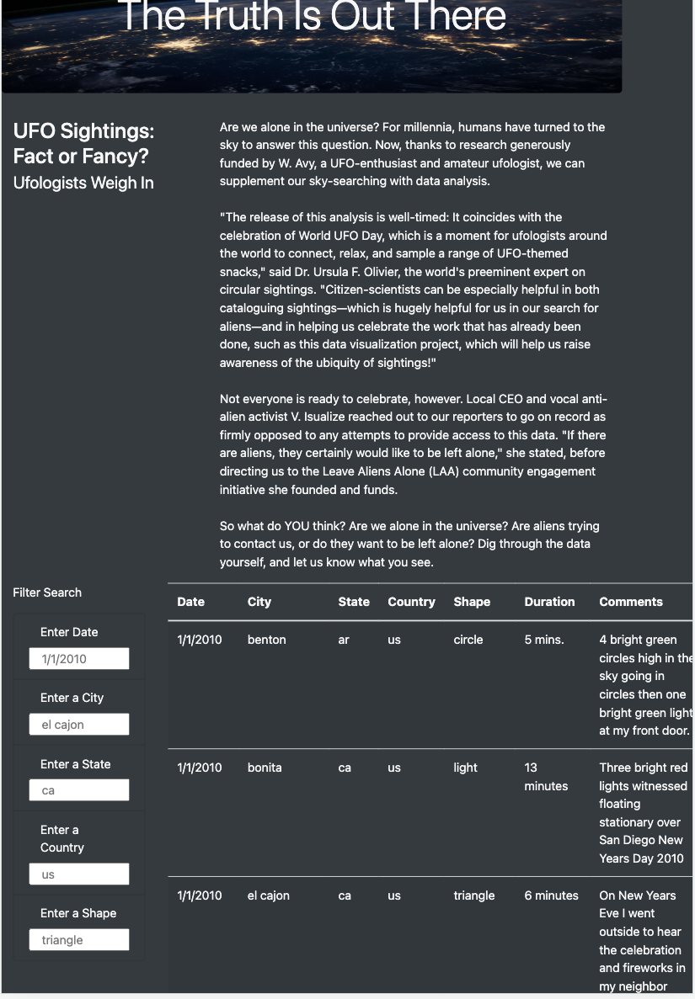
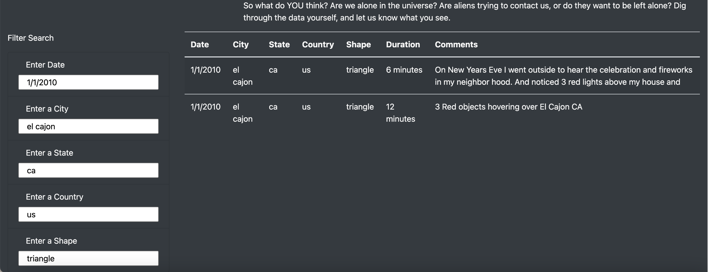
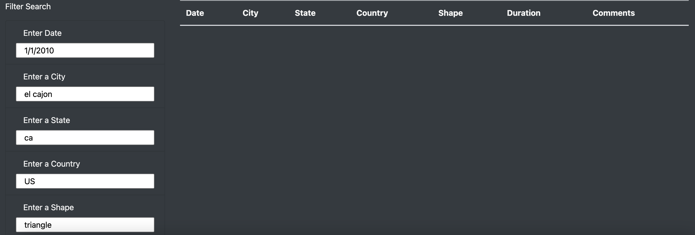
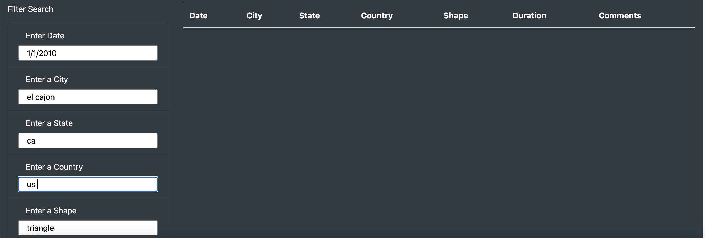

# UFOs

## Overview of Project
A data journalist is given an opportunity to write about her hometown: McMinnville, OR. Apart from revisiting memories and people back home, she is excited to record the sightings of UFOs in her hometown and post them online. The project aims to provide interactive visualizations depicting in-depth analysis of UFO sightings using front end technologies like JavaScript, HTML and CSS. Below is the breakdown of tasks achieved in this project: 

- Build a table using data stored in a JavaScript array.
- Create filters to make this table fully dynamic.
- Place the table into an HTML file for easy viewing.
- Customize the webpage using Bootstrap.
- Equip the table with several fully functional filters that will allow users to interact with the visualizations.
  - Allow users to filter data using date.
  - Facilitate users to filter by city, state, country and shape.

## Results

- Upon launching the project, the landing page looks as below:

- By scrolling down the page to the Filter Search section, it can be observed that all of the available UFO sightings are displayed toward the right on the screen. When the user types in the suggested placeholder elements as filters, the results section shows 2 matches. Please make sure to type everything in lower case letters and do not have spaces at the end of the text. Click off the input box or press enter to initiate the filter. To reset the filter criteria, click the UFO Sightings at the top left of the website.

## Summary

### A drawback of this new design
- The user must know specific dates, cities, or shapes to search. The filters require the user type in correct lower-case spellings and cannot include spaces at the end. If the user types in "US" or "USA" or "United States" or "us " for country, the results will not show up. The only acceptable input for country would be 'us'.
<table>
  <tr>
    <td>Country in upper case</td>
    <td>Country followed by space</td>
  </tr>
  <tr>
    <td></td>
    <td></td>
  </tr>
</table>

### Recommendations for further development

The webpage developed for the project is pretty basic. Several enhancements can be done with respect to datasets and appearance of the web page.
- Clean up and enhance the dataset.
  - All entries in the dataset can be changed to similar format in each field. Some examples include replacing abbreviations of countries and states with  actual names; refining the Duration entry to a single measurement of time (seconds or minutes), paying attention to letter cases in entries, etc.
  - The userbase of the aplication can be broadened by adding in more sightings from other countries. If the data gets larger, there is always a chance of the web page slowing down everytime a filter is changed. Then, an overall redesign is needed to introduce document based database (like MongoDB) in the project and even better is to put in Flask and Python technologies to use.
- More enhancements to the web page can be done as below:
  - Implement case insensitive filter search. Pick lists (or dropdown lists) for Country and Shape can be implemented so that the user can filter on available countries and shapes instead of searching for a specific format. A date picker can also be used to select date. 
  - More CSS and Bootstrap classes can be added (e.g., borders to Filter Search section and table results section).
  - Upon filtering the criteria, the count of filtered records can be displayed above/below the dynamic table. Pagination can be implemented for large datasets. A link beside column header (on City, Country, Shape and Duration) can be placed to sort the filtered records. 
  - A Reset button can be provided in the Filter Search section to erase the current filters instead of scrolling up and clicking the UFO Sightings link.
  - As with any web application accepting user input in textboxes, sanitizing input (using Regular Expressions) and validating formats is recommended to prevent cross site scripting (XSS) vulnerabilities.
